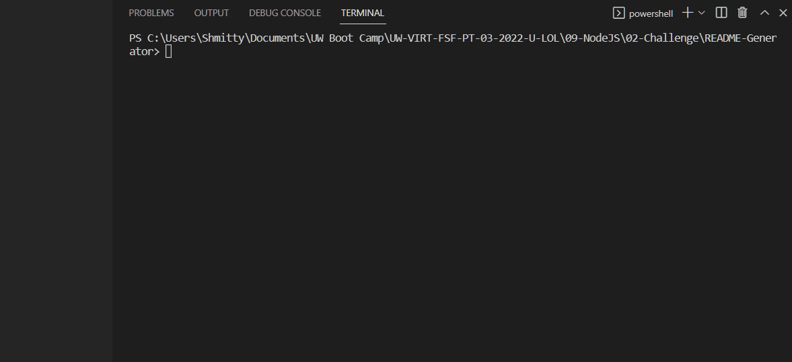

# goodREADMEGen

## Description
This node.js based command line app will generator an organized README via prompts asked to the user when run. Witness the following lengthy gif for a demo.


## Table of contents
* [Installation](#installation)
* [Usage](#usage)
* [License](#license)
* [Contributing](#contributing)
* [Tests](#tests)
* [Questions](#questions)
        
## Installation
To install necessary dependencies, run the following command:
```
npm i
```
## Usage
Read the README
## License 
This project is licensed under the MIT license.
## Contributing
Check our issues page
## Tests
To run tests, run the following command:
```
npm test
```
## Questions
If you have any questions about this repository, open an issue or contact me directly at mattszmy@live.com. You can find more of my work at [Shiver750](https://github.com/Shiver750).